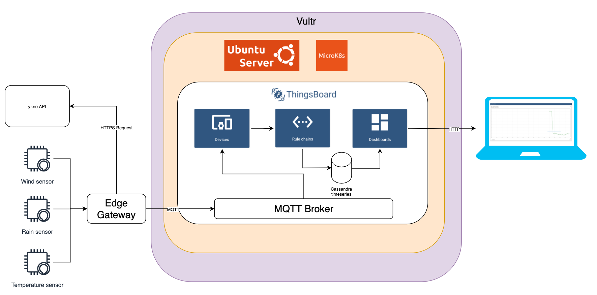

# Project: Local Weather VS YR.NO

## Background

I live in an area where weather is extremely local, this means that I can't rely on weather services like SMHI and YR.no. With this project I would like to compare my local weather conditions with what is reported by YR.no

## Project components

I'm going to utilizw the public cloud as the infrastructure for this project. Specifically AWS as an IaaS (Infrastructure as a service) provider. I will also use an open source IoT-platform called Thingsboard (https://thingsboard.io). Thingsboard will be hosted on a AWS EC2 instance running Ubuntu server and MicroK8s.

Data is going to be collected by an edge gateway and sent to Thingsboard using MQTT.

Using the visualization framework in Thingsboard, I'm going to create a Dashboard to visualize Local and YR.no weather data. 

### AWS EC2

This is how I deployed an EC2 in AWS

### Ubuntu and Microk8s

This is how I deployed Ubuntu and Microk8s

### Thingsboard

This is how I deployed Thingsboard

### Edge gateway

This is how I deployed the Edge gateway